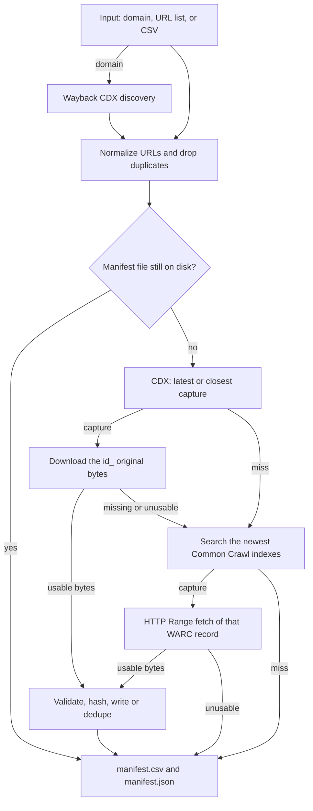

# wayback-image-recovery

[](https://github.com/mohamd764/wayback-image-recovery/actions/workflows/ci.yml)
[](LICENSE)
[](https://www.python.org/downloads/)

Recover lost website images — or any other archived asset — from the [Internet Archive Wayback Machine](https://web.archive.org/) and [Common Crawl](https://commoncrawl.org/). Point it at a domain, a URL list, or a CSV of broken image links. It finds a real capture, downloads the original bytes, rejects HTML error pages and truncated files, and writes a manifest you can audit.

Author: [Mohamed Fouad](https://github.com/mohamd764).

## The problem

A CMS migration, a CDN path change, or an expired domain can make every image on a site 404 at once. The bytes are often still in a public web archive, but getting them back by hand does not scale:

- The Wayback calendar UI wraps captures in HTML. You want the original file, not the toolbar.
- The newest capture is sometimes a soft-404 page saved with HTTP 200.
- The same logo shows up at dozens of URLs.
- A capture missing from the Wayback Machine may still exist in Common Crawl.

`wayback-image-recovery` is a small pipeline for that job. It does not crawl the live web.

## Install

Python 3.9 or newer.

```bash
pip install "git+https://github.com/mohamd764/wayback-image-recovery.git"
```

The install provides two commands, `wayback-image-recovery` and the short alias `wir`.

For local development:

```bash
git clone https://github.com/mohamd764/wayback-image-recovery.git
cd wayback-image-recovery
python -m pip install -e ".[dev]"
```

## Quick start

```bash
# Every image capture under a domain. Files keep the original host and path.
wir recover --domain example.com --output ./recovered

# An explicit list, preferring the capture closest to a date.
wir recover urls.txt --closest 2020-01-01 --output ./recovered

# A CSV export of broken image URLs (url, image_url, or src column).
wir recover --csv broken-images.csv --min-bytes 2048

# Stdin. Re-running the same command skips files already on disk.
cat urls.txt | wir recover - --output ./recovered
```

After a run, `./recovered` contains the files plus:

| File | Role |
| --- | --- |
| `manifest.csv` | One row per input URL for this run |
| `manifest.json` | The same rows, plus a summary |
| `manifest.jsonl` | Append-only log used to resume |

CSV columns: `url`, `source`, `timestamp` (the snapshot time), `status`, `sha256`, `path`, `bytes`, `mimetype`, `error`.

```text
Processed 4 URL(s)
recovered=2 duplicate=1 skipped=0 not_found=1 invalid=0 error=0
Manifest: recovered/manifest.csv
Report: recovered/manifest.json
```

Exit `0` when the run finished and no row has status `error`. `not_found` is a normal outcome: the archives do not have every URL. Exit `1` if any row is `error`, or if you passed `--strict` and any URL was not recovered. Exit `2` for bad arguments.

## Demo

An illustrative session (archives are rate-limited; a real run prints one progress line per URL):

```text
$ wir recover --domain example.com -o ./recovered --max-urls 3
discovered 3 URL(s) for example.com
[1/3] recovered  20210314120000  https://example.com/images/logo.png
[2/3] duplicate  20200601090000  https://example.com/cdn/logo.png
[3/3] not_found  -  https://example.com/images/retired.jpg
Processed 3 URL(s)
recovered=1 duplicate=1 skipped=0 not_found=1 invalid=0 error=0
Manifest: recovered/manifest.csv
Report: recovered/manifest.json

$ python -c "from PIL import Image; print(Image.open('recovered/example.com/images/logo.png').size)"
(320, 80)
```

## How it works



Domain discovery asks the [Wayback CDX API](https://github.com/internetarchive/wayback/tree/master/wayback-cdx-server) for unique URLs (`collapse=urlkey`) filtered by MIME type and status code. That listing is not trusted as the newest bytes: CDX collapse keeps consecutive rows, which are oldest-first inside a URL. Each URL is resolved again with `sort=reverse&limit=1` (latest) or `sort=closest` (the `--closest` timestamp).

Downloads use the `id_` replay modifier:

```text
https://web.archive.org/web/{timestamp}id_/{original-url}
```

`id_` returns the archived payload without the Wayback toolbar. If that body is missing, HTML, or truncated, the URL is looked up in Common Crawl. The tool reads `collinfo.json`, searches the newest few indexes, and fetches the matching WARC record with an HTTP `Range` request. Each Common Crawl record is its own gzip member; the HTTP entity body is what gets validated.

Images are opened with Pillow (`verify`, then `load`). SVG is accepted as XML. AVIF/HEIF fall back to an ISO-BMFF brand check when this Pillow build has no decoder. Anything that hashes to bytes already saved is recorded as `duplicate` and not written twice. Paths are derived from the URL and cannot climb out of the output directory with `..`.

## Status values

| Status | Meaning |
| --- | --- |
| `recovered` | Bytes saved for this URL |
| `duplicate` | Same sha256 already stored; `path` points at that file |
| `skipped` | A previous run already saved this URL and the file is still there |
| `not_found` | No matching Wayback or Common Crawl capture |
| `invalid` | A capture downloaded, but it was HTML, truncated, or smaller than `--min-bytes` |
| `error` | Lookup or download failed. Re-run the same command; these rows are retried |

## Library

```python
import asyncio
from pathlib import Path

from wayback_image_recovery import RecoveryConfig, recover_urls


async def main() -> None:
    report = await recover_urls(
        ["https://example.com/images/logo.png"],
        RecoveryConfig(output_dir=Path("recovered"), rate_per_second=1.0),
    )
    print(report.summary)


asyncio.run(main())
```

`run()` is the synchronous helper the CLI uses. From inside an event loop, await `recover_urls()` or `discover_urls()` instead. Pass your own client to either function when you want a mirror or a test double; the default client is rate-limited and retried. Injected clients are used as-is.

Useful `RecoveryConfig` fields: `concurrency`, `rate_per_second`, `max_retries`, `closest`, `mimetypes`, `status_codes`, `flat`, `resume`, `min_bytes`, `max_bytes`, `cdx_endpoint`, `wayback_replay_base`, `cc_indexes`.

## Why this and not a one-off script

| Approach | What it is good at | What you still have to build |
| --- | --- | --- |
| Browser, one `id_` URL | A single file | Nothing, until the list is long |
| `waybackpack` | Downloading archived pages from CDX | Image checks, dedupe, Common Crawl, a manifest |
| `internetarchive` / `ia` | Items and metadata in the Archive | CDX image selection and WARC range reads |
| This tool | Asset recovery with validation, resume, and a second archive | Judgement about what you have the right to republish |

## Ethics and the archives

The Wayback Machine and Common Crawl are shared infrastructure. This tool is built to be polite by default:

- One request start per second (`--rate`). Concurrency (`--concurrency`, default 4) only overlaps downloads; it does not raise the start rate.
- An identifiable User-Agent: `wayback-image-recovery/<version> (+https://github.com/mohamd764/wayback-image-recovery; archive asset recovery)`.
- Capped retries with exponential backoff, jitter, and a numeric `Retry-After` when a server sends one.
- At most three of the newest Common Crawl indexes per URL (`--cc-index-limit`).
- A hard `--max-bytes` (default 50 MiB) so one huge object cannot exhaust memory.

`--rate 0` or a rate above 5 requests/second against `archive.org` or `commoncrawl.org` logs a warning. Do that only against your own mirror, or when you have permission. `--cdx-endpoint`, `--wayback-replay-base`, `--cc-collinfo-url`, `--cc-data-url`, and `--cc-index` exist so tests and private replicas never have to hit the public hosts.

Please read the [Internet Archive Terms of Use](https://archive.org/about/terms.php) and the [Common Crawl Terms of Use](https://commoncrawl.org/terms-of-use) before you publish recovered files. A capture being public is not the same as a license to reuse it. Prefer restoring assets you own, operated, or have rights to. Do not use this tool to hammer the archives, to reconstruct material that was excluded or taken down, or to bypass access controls on the live site. The original site's `robots.txt` does not grant or deny access to an archival copy, but it is still a signal about the publisher's wishes.

## Roadmap

These are intentionally small and labeled for a `good first issue`:

- `--dry-run` that resolves snapshots and writes the manifest without downloading bodies.
- An optional progress bar and ETA.
- `--retry-errors` to reprocess only rows whose latest status is `error`.
- Sitemap XML as an input.
- An SQLite manifest for very large jobs.
- Use the CDX latest-capture index during domain discovery so each URL does not need a second lookup.

## Contributing

See [CONTRIBUTING.md](CONTRIBUTING.md). Tests use a fake HTTP client and refuse live sockets. Please do not add credentials, private URL lists, or third-party customer data.

## License

[MIT](LICENSE) © 2026 Mohamed Fouad.
